####
            

        curl -fsSL https://test.docker.com -o test-docker.sh
        sh test-docker.sh
		
        sudo chmod 777 /var/run/docker.sock
        sudo usermod -aG docker ubuntu
		
		Exit the instance ...and relogin

        Multi Stage Docker build
        Multi staged build is used to build the code and copy necessary files into the final stage which will be your image.
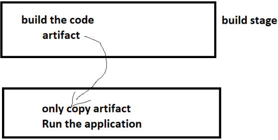

        Multi-stage builds link https://docs.docker.com/build/building/multi-stage/

        Scenario – 1: Java Spring petclinic

        To build this application we need
        jdk17
        maven
        git

        Manual steps:
    
         ` git clone https://github.com/spring-projects/spring-petclinic.git `
         ` cd spring-petclinic `
        mvn package ----once you dothis creating jar file...
        # a file gets created in target/spring-petclinic-*.jar

        To run this application we need jdk 17

        Dockerfile....

         ### 
             FROM ubuntu AS generator
             RUN mkdir /test && touch test/{1..10}.text

             FROM alpine
             COPY --from=generator /test /test
             CMD ["sleep","1d"] 
         ###

        ` docker image build -t exp .  `
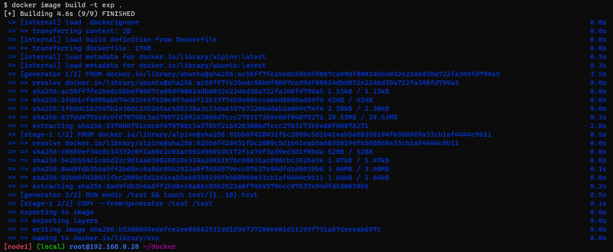
        
         Dockerfile....
          
          ` mkdir spc `
          ` cd spc `
          ` vi Dockerfile `
          ` sudo apt install openjdk-17-jdk -y `
          ` sudo apt install maven `
          
        ###
           FROM alpine/git AS vcs
           RUN cd / && git clone https://github.com/spring-projects/spring-petclinic.git && \
                pwd && ls /spring-petclinic

           FROM maven:3-amazoncorretto-17 AS builder
           COPY --from=vcs /spring-petclinic/spring-petclinic
           RUN ls /spring-petclinic
           RUN cd spring-petclinic && mvn pacage

           FROM amazoncorretto:17-alpine-jdk
           LABEL author="raju"
           EXPOSE 8080
           ARG HOME_DIR=/spc
           WORKDIR ${HOME_DIR}
           COPY --from=builder /spring-petclinic/target/spring-*.jar ${HOME_DIR}/spring-petclinic.jar
           EXPOSE 8080
           CMD ["java',"jar","spring-petclinic-jar"]

           ###

         ` docker image build -t spc:3.0.0 . `
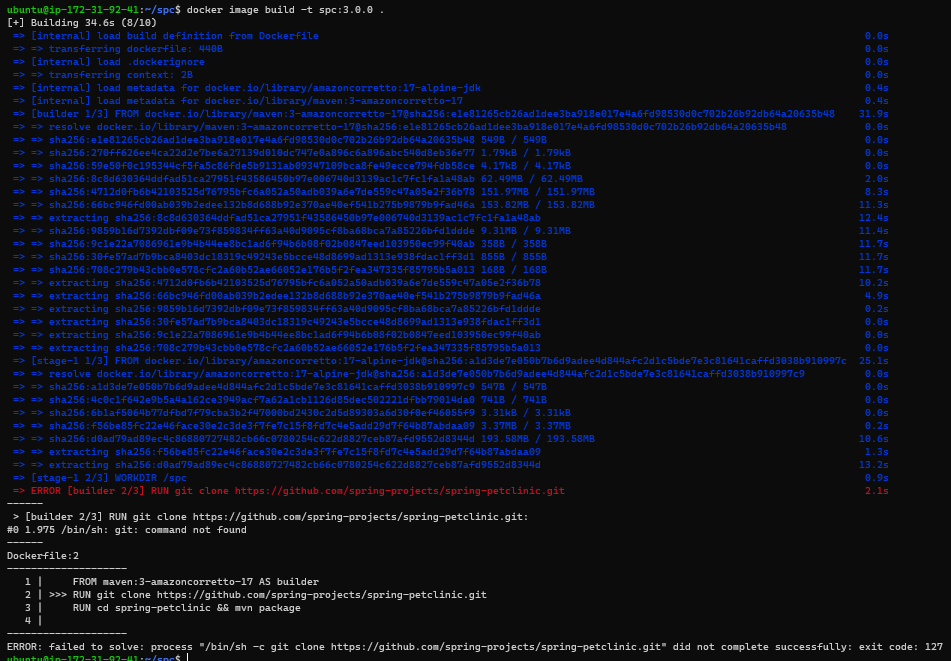

         ` docker container run -it maven:3-amazoncorretto-17 /bin/bash `
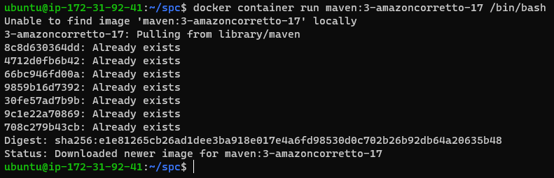

         ` docker container rm -f $(docker container ls -a -q) `
         ` docker image rm -f $(docker image ls -a -q)
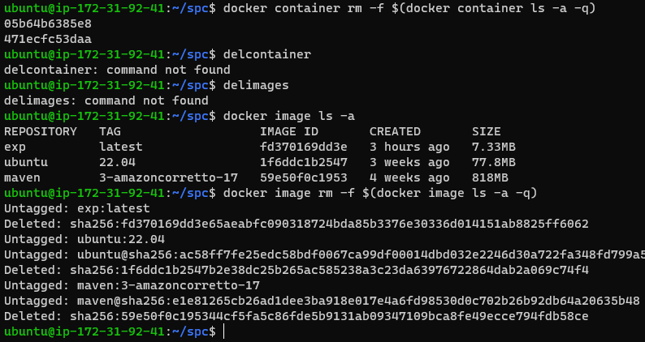
         
          Dockerfile....

         ### 
             FROM ubuntu AS generator
             RUN mkdir /test && touch test/{1..10}.text

             FROM alpine
             COPY --from=generator /test /test
             CMD ["sleep","1d"] 
         ###

        ` docker image build -t exp .  `

         

         ` docker container run -it ubuntu:20.04 /bin/bash `
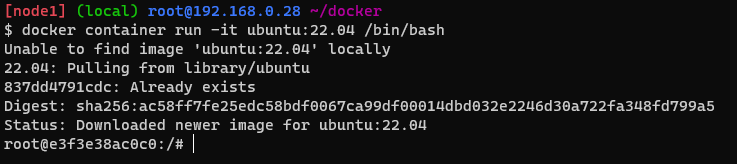 
         ` mkdir /nop `
         ` cd nop `
         ` apt update `
         ` apt install unzip `
         ` apt install wget `
         ` wget https://github.com/nopSolutions/nopCommerce/releases/download/release-4.60.3/nopCommerce_4.60.3_NoSource_linux_x64.zip

         ` apt install wget `

         ` ls `
         ` unzip nopCommerce_4.60.3_NoSource_linux_x64.zip `
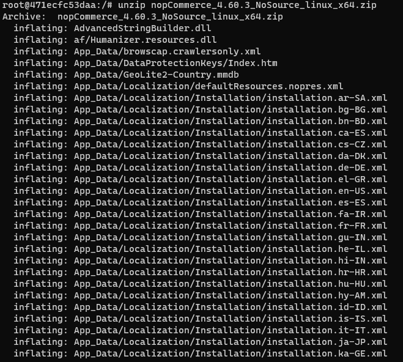
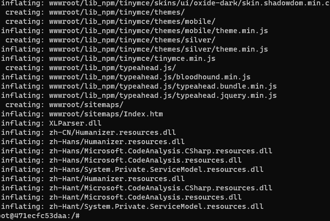
          ` ls ` ----first
         `  rm nopCommerce_4.60.3_NoSource_linux_x64.zip `
         ` ls ` -----second
               
                  1 & 2 showing same result so we instaling unnessasary files

         ` docker containeer run --name test -d -P spc:3.0.0 `
         ` docker container ls `
                
                it will show some ports go and check the ip address withports...
                 showing pet-clinic image...

         To run this application we need jdk 17
      
        https://github.com/asquarezone/DockerZone/commit/968357bc0da234840996e75b3394811715bc35a9
              for the changes done to create spring petclinic as multistage build.
         
         Scenario -2 Game of life
          
          code link https://github.com/wakaleo/game-of-life
          tools:
          jdk 8
          git
          maven

         Dockerfile...for gameoflife...

         ` mkdir game `
         ` cd game `
         ` vi Dockerfile `

          ###
             FROM alpine/git AS vcs
             RUN cd / && git clone https://github.com/wakaleo/game-of-life.git

             FROM maven:3-amazoncorretto-8 AS builder
             COPY --from=vcs /game-of-life /game-of-life
             RUN cd /game-of-life && mvn package

             FROM tomcat:9-jdk8
             LABEL author="khaja" organization="qt"
             COPY --from=builder /game-of-life/gameoflife-web/target/*.war /usr/local/tomcat/webapps/gameoflife.war
             EXPOSE 8080
             ###

         ` docker image build -t game . `
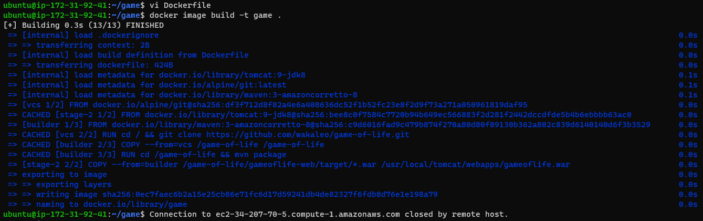

         game-of-life dockerfile link https://github.com/asquarezone/DockerZone/commit/b16d521e8a8d35471ffa918a7fcd6951f4d7fecd

         ` docker image ls `
                image will show gameoflife.....

        Pushing images to Registries...

             Docker Hub

             Public Registry: Docker Hub https://hub.docker.com/

              Create a public Repository
              Repository will be in the form of <username>/<repo-name>:<tag>
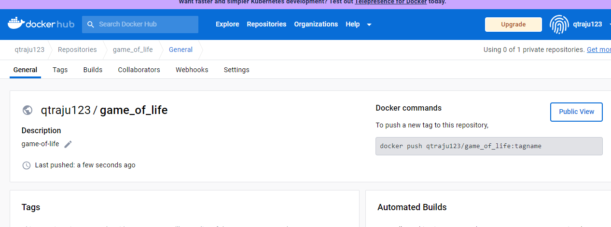

         After building the image tag the image to new naming format...

         ` docker image tag spc:3.0.0 shaikhajaibrahim/qtspringpetclinic:3.0.0 `
         ` docker image ls `
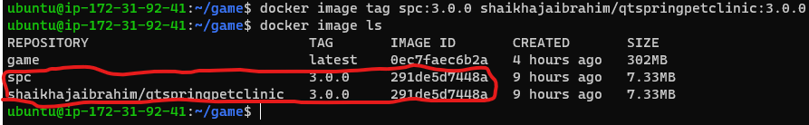

         * if this image has to be default also tag with latest (optional)

         let me make a defult image 
         ` docker image tag spc:3.0.0 shaikhajaibrahim/qtspringpetclinic:latest `
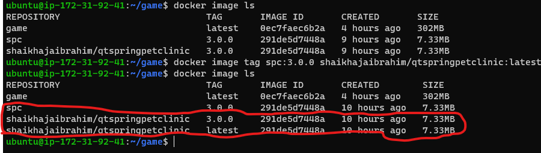
         
         docker images are collection of meta data...

         * login into docker hub from cli

          ` docker login `
          ` docker login `
          enter the user name and passward
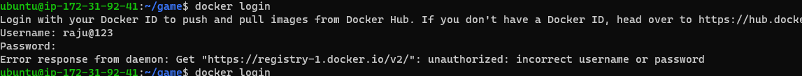

        * lets push the images

        docker image push avadam ledhu edhi malli oaksari cheyali 

        * take a new instance pull a public image for spring-petclinic

        ` docker container run -d -P shaikhajaibrahim/qtspringpetclinic `
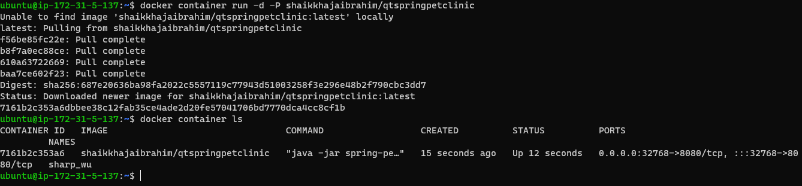
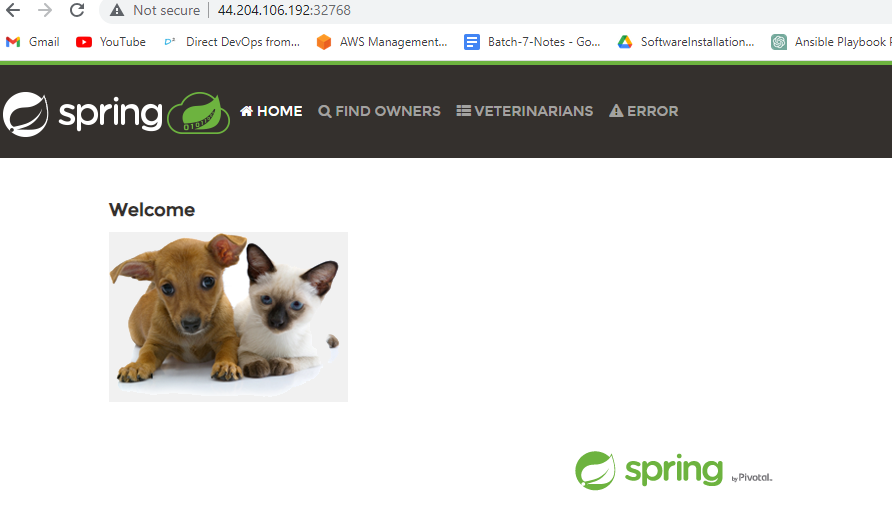

      ### Private Registries

         * There are many applciations for hosting private registries
           * AWS: ECR (Elastic container registry)
           * Azure: ACR (Azure Container Registry)
           * Jfrog
        
      ###AWS ECR
           
           * Create an ECR Repository
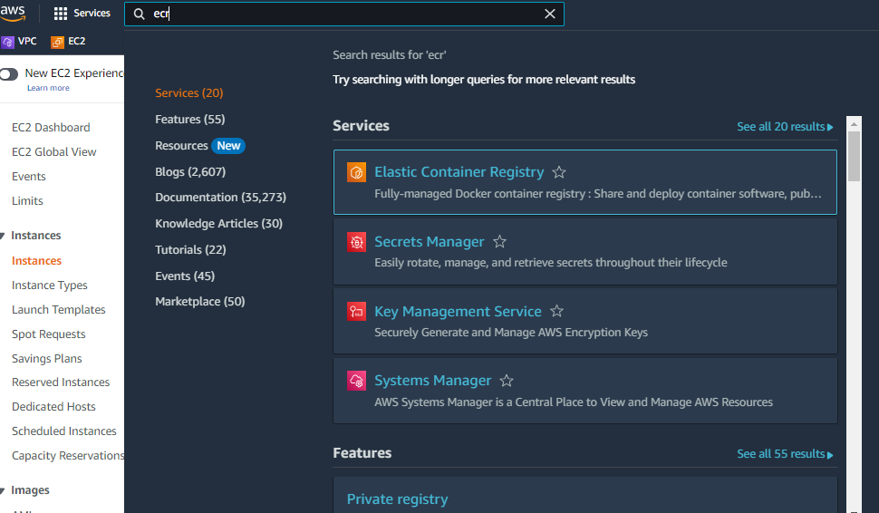
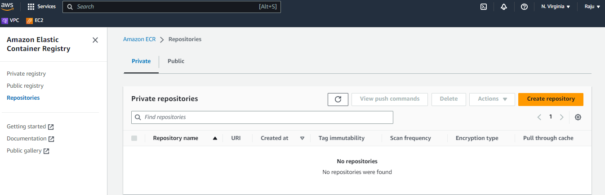
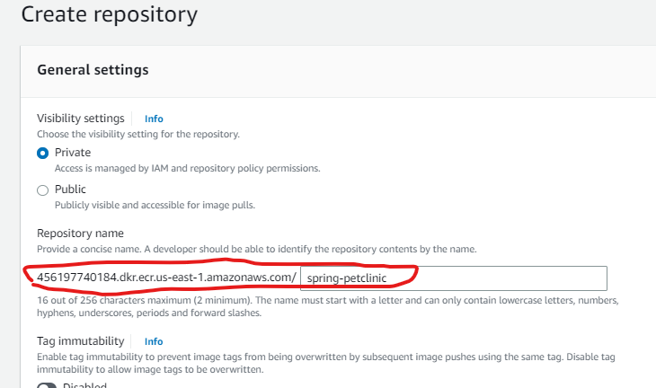
           * view push commands...
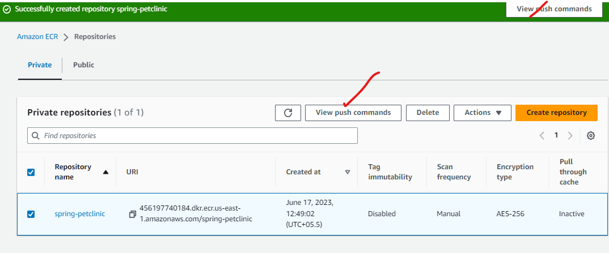
           * push commands....
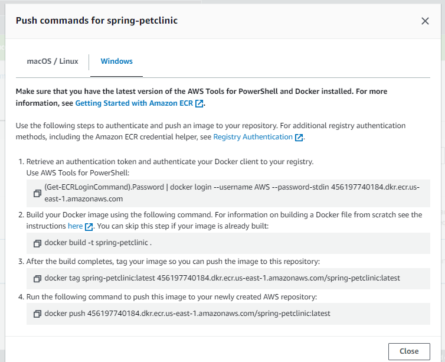

          
           * install and configure aws cli link here..https://sst.dev/chapters/create-an-iam-user.html

           *** Azure ACR

           * Refer Here for detailed information...
             https://learn.microsoft.com/en-us/azure/container-instances/container-instances-tutorial-prepare-acr

             
        

             

          

